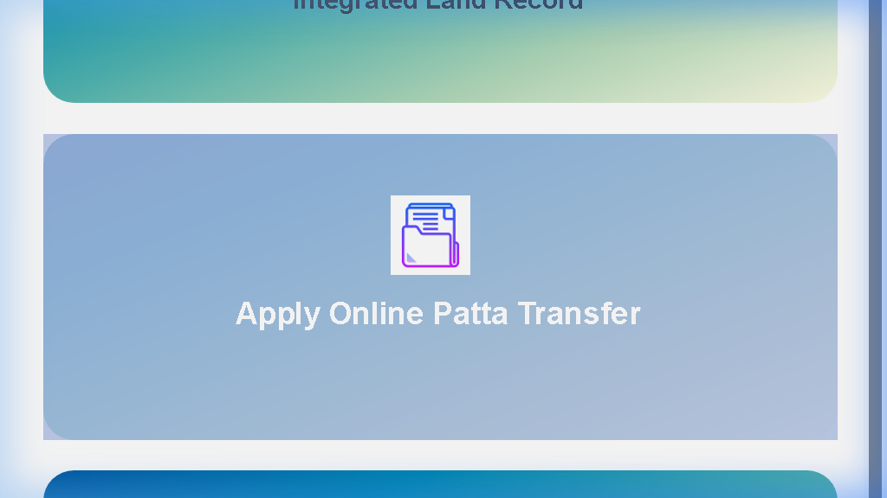
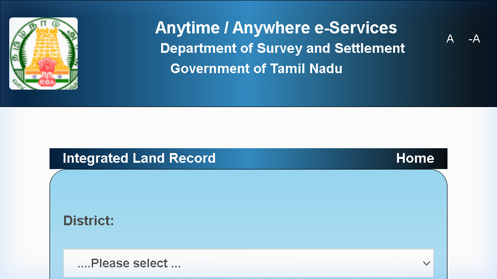
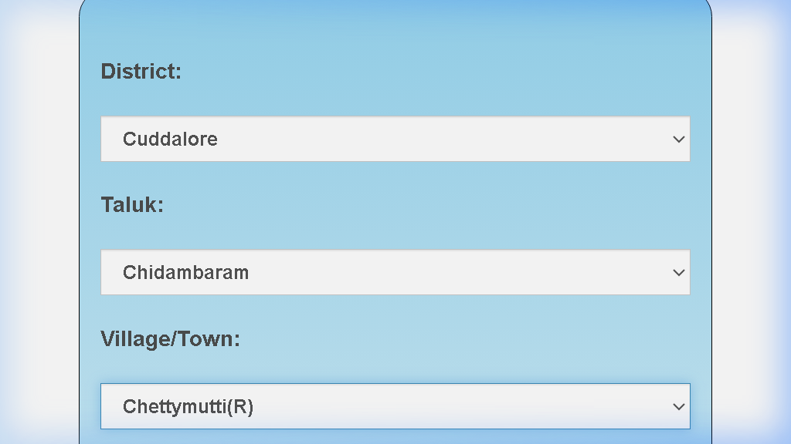
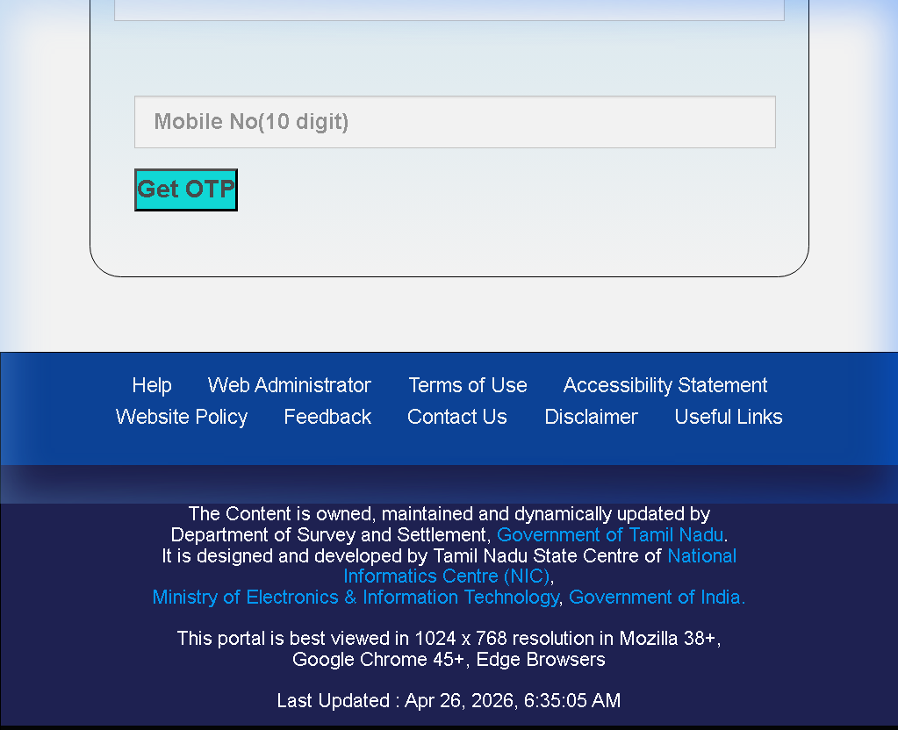

# Manual Patta/Owner Extraction Guide

Since real-time Patta and Owner details are protected by government security (OTP and Captcha), this guide will walk you through the manual process of bridging that data.

## Step 1: Navigate to the Home Page
Go to: [https://eservices.tn.gov.in/eservices_en/index.html](https://eservices.tn.gov.in/eservices_en/index.html)
Click on the **'Integrated Land Record'** tile (the first green tile on the left).

## Step 2: Select Location
Enter the **District**, **Taluk**, and **Village** for the parcel you are investigating.

## Step 3: Enter Survey Number
Select the **'Survey Number'** radio button and enter the numeric survey number and sub-division.

## Step 4: Authentication
1. Enter your **Mobile Number**.
2. Click **'Get OTP'** and enter the code received.
3. Enter the **Captcha** and click **Submit**.

## Step 5: Update the Spreadsheet
Once the Patta/Chitta PDF opens, extract the **Owner Name** and **Patta Number**, then update the `Manual_Input_Template.csv` in this repository.

---
### Estimated Time
- **Per Plot:** 2-3 minutes.
- **Goal:** Update 10-20 priority plots per session.
